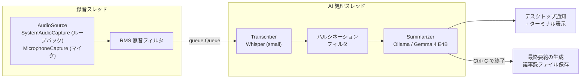

# memorandum — 完全ローカル会議アシスタント

Web 会議・対面会議の音声をローカル AI だけで文字起こし・要約するパーソナル議事録ツールです。
録音中は約 1 分ごとに要約をデスクトップ通知し、終了時には会議全体の議事録を自動生成します。
**音声・テキストは一切外部サーバーへ送信されません。**

- STT: [OpenAI Whisper](https://github.com/openai/whisper)（ローカル実行）
- 要約: [Ollama](https://ollama.com/) + Gemma 4 E4B（ローカル LLM）
- 対応 OS: Windows 10/11 · macOS

## 特徴

- **Web 会議対応** — Windows では WASAPI ループバックにより、スピーカー / イヤホンへ再生される相手の音声を仮想デバイスなしで直接録音（`--source system`、既定）。対面会議はマイク入力（`--source mic`）
- **リアルタイム要約** — 直近 1 分の発言を 30 文字程度に要約し、デスクトップ通知とターミナルに表示
- **議事録の自動生成** — `Ctrl+C` で終了すると、会議全体の最終要約とタイムスタンプ付き全原文を `meeting_log_YYYYMMDD_HHMMSS.txt` に保存
- **録音が途切れないパイプライン** — 録音スレッドと AI 処理スレッドをキューで分離し、文字起こし・要約の実行中も録音を継続
- **ハルシネーション抑制** — 音圧 (RMS) による物理チェックと Whisper の無音確信度・定型文フィルタの二段構え

## アーキテクチャ



録音（プロデューサー）と推論（コンシューマー）を分離しているため、Whisper + LLM の処理に
数十秒かかっても次の 1 分の録音は止まりません。

## クイックスタート

| OS | 手順 |
| --- | --- |
| Windows | [環境構築_Windows.md](docs/環境構築_Windows.md) の事前準備の後、`run.bat` をダブルクリック |
| macOS | [環境構築_macOS.md](docs/環境構築_macOS.md) の事前準備の後、`run.command` をダブルクリック |

初回起動時は仮想環境の作成・依存ライブラリのインストール・Whisper モデルのダウンロードが自動で行われます。
事前に [Ollama](https://ollama.com/) のインストールと `ollama pull gemma4:e4b` が必要です
（メモリ 8GB クラスのマシンでは軽量な `gemma4:e2b` を推奨。`--llm-model gemma4:e2b` で指定）。

## 使い方

```
python memorandum.py [オプション]
```

| オプション | 既定値 | 説明 |
| --- | --- | --- |
| `--source {system,mic}` | Windows: `system` / macOS: `mic` | 録音する音源（スピーカー出力 / マイク） |
| `--llm-model` | `gemma4:e4b` | 要約に使う Ollama モデル |
| `--whisper-model` | `small` | Whisper モデルサイズ |
| `--language` | `ja` | 文字起こしの言語コード |
| `--chunk-seconds` | `60` | 1 サイクルの録音秒数 |
| `--rms-threshold` | `0.005` | 無音とみなす音圧しきい値 |
| `--output-dir` | カレント | 議事録の保存先ディレクトリ |
| `--no-notify` | — | デスクトップ通知を無効化 |

実行イメージ:

```
🚀 完全ローカル・会議アシスタント稼働中
   入力: スピーカー出力 (Web会議)
   STT: Whisper (small) / LLM: gemma4:e4b
   【Ctrl+C】で終了し、最終レポートを作成します。

--- 原文 [14:03:12] ---
次回の会議は金曜日の午後3時からです。資料は山田さんが準備します。
💡 要約: 次回会議は金曜15時、資料は山田さんが準備
```

## 設計上のポイント

- **プロデューサー・コンシューマー並行処理** — 録音と推論を `queue.Queue` で分離し、発言の取りこぼしを防止。終了時は残キューを処理し切ってから最終要約へ移行
- **`Protocol` による音源の抽象化** — `AudioSource` インターフェースにより、ループバック / マイクをオーケストレーターから透過的に扱う
- **フェイルセーフ設計** — 起動時に Ollama への接続とモデルの存在を検証して即時エラー通知（fail fast）。通知の失敗は本体を止めず、最終要約の生成に失敗しても原文の議事録は必ず保存
- **クロスプラットフォーム対応** — 依存関係は環境マーカーで OS ごとに自動切替。Windows のコンソールエンコーディング (cp932) 起因のクラッシュも吸収

## ドキュメント

| ドキュメント | 内容 |
| --- | --- |
| [システム仕様書](docs/システム仕様書.md) | アーキテクチャ・機能仕様 |
| [システム受入条件書](docs/システム受入条件書.md) | 受入条件と検証状況 |
| [タスク分解マップ](docs/タスク分解マップ.md) | 開発タスクの分解と進捗 |
| [環境構築 (macOS)](docs/環境構築_macOS.md) / [環境構築 (Windows)](docs/環境構築_Windows.md) | セットアップ手順 |
