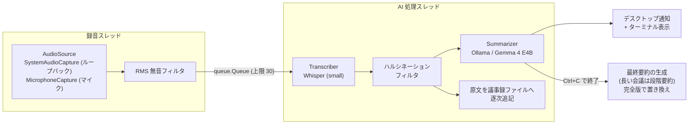

# memorandum — 完全ローカル会議アシスタント

[](https://github.com/poporpepopo/memorandum/actions/workflows/ci.yml)
[](LICENSE)

Web 会議・対面会議の音声をローカル AI だけで文字起こし・要約するパーソナル議事録ツールです。
録音中は約 1 分ごとに要約をデスクトップ通知し、終了時には会議全体の議事録を自動生成します。
**音声・テキストは一切外部サーバーへ送信されません。**

- STT: [OpenAI Whisper](https://github.com/openai/whisper)（ローカル実行）
- 要約: [Ollama](https://ollama.com/) + Gemma 4 E4B（ローカル LLM）
- 対応 OS: Windows 10/11 · macOS

## 特徴

- **Web 会議対応** — Windows では WASAPI ループバックにより、スピーカー / イヤホンへ再生される相手の音声を仮想デバイスなしで直接録音（`--source system`、既定）。対面会議はマイク入力（`--source mic`）
- **リアルタイム要約** — 直近 1 分の発言を 30 文字程度に要約し、デスクトップ通知とターミナルに表示
- **議事録の自動生成** — 原文は文字起こしのたびに `meeting_log_YYYYMMDD_HHMMSS.txt` へ追記し、`Ctrl+C` で終了すると会議全体の最終要約を加えた完全版に置き換える。ウィンドウを閉じる・クラッシュするといった終わり方でも、文字起こし済みの原文は残る
- **長い会議でも全体を要約** — コンテキスト長を明示して会議全体 (約 75 分まで) を 1 回で LLM に渡し、それを超える会議だけ時間帯ごとに段階的に要約する。Ollama の既定コンテキスト (4K トークン) で会議の前半が黙って切り捨てられることがない
- **録音が途切れないパイプライン** — 録音スレッドと AI 処理スレッドを上限付きキューで分離し、文字起こし・要約の実行中も録音を継続。推論が録音に追いつかない場合は最も古い未処理チャンクから破棄し、破棄の発生は警告ログと議事録ファイルの両方に明記
- **ハルシネーション抑制** — 音圧 (RMS) による物理チェック、Whisper の無音確信度、定型文フィルタ (セグメント単位) の三段構え

## アーキテクチャ


```mermaid
flowchart LR
    subgraph capture["録音スレッド"]
        SRC["AudioSource<br/>SystemAudioCapture (ループバック)<br/>MicrophoneCapture (マイク)"] --> RMS["RMS 無音フィルタ"]
    end
    RMS -- "queue.Queue (上限 30)" --> STT
    subgraph worker["AI 処理スレッド"]
        STT["Transcriber<br/>Whisper (small)"] --> HAL["ハルシネーション<br/>フィルタ"]
        HAL --> SUM["Summarizer<br/>Ollama / Gemma 4 E4B"]
        HAL --> LOG["原文を議事録ファイルへ<br/>逐次追記"]
    end
    SUM --> NOTIFY["デスクトップ通知<br/>+ ターミナル表示"]
    SUM -- "Ctrl+C で終了" --> REPORT["最終要約の生成<br/>(長い会議は段階要約)<br/>完全版で置き換え"]
```

録音（プロデューサー）と推論（コンシューマー）を分離しているため、Whisper + LLM の処理に
数十秒かかっても次の 1 分の録音は止まりません。

## クイックスタート

| OS | 手順 |
| --- | --- |
| Windows | [環境構築_Windows.md](docs/環境構築_Windows.md) の事前準備の後、`run.bat` をダブルクリック |
| macOS | [環境構築_macOS.md](docs/環境構築_macOS.md) の事前準備の後、`run.command` をダブルクリック |

初回起動時は仮想環境の作成・依存ライブラリのインストール・Whisper モデルのダウンロードが自動で行われます。
事前に [Ollama](https://ollama.com/) のインストールと `ollama pull gemma4:e4b` が必要です
（メモリ 8GB クラスのマシンでは軽量な `gemma4:e2b` を推奨。`--llm-model gemma4:e2b` で指定）。

## 使い方

```
python memorandum.py [オプション]
```

| オプション | 既定値 | 説明 |
| --- | --- | --- |
| `--source {system,mic}` | Windows: `system` / macOS: `mic` | 録音する音源（スピーカー出力 / マイク） |
| `--llm-model` | `gemma4:e4b` | 要約に使う Ollama モデル |
| `--whisper-model` | `small` | Whisper モデルサイズ |
| `--language` | `ja` | 文字起こしの言語コード |
| `--chunk-seconds` | `60` | 1 サイクルの録音秒数 |
| `--rms-threshold` | `0.005` | 無音とみなす音圧しきい値 |
| `--output-dir` | カレント | 議事録の保存先ディレクトリ |
| `--no-notify` | — | デスクトップ通知を無効化 |

実行イメージ:

```
🚀 完全ローカル・会議アシスタント稼働中
   入力: スピーカー出力 (Web会議)
   STT: Whisper (small) / LLM: gemma4:e4b
   【Ctrl+C】で終了し、最終レポートを作成します。

--- 原文 [14:03:12] ---
次回の会議は金曜日の午後3時からです。資料は山田さんが準備します。
💡 要約: 次回会議は金曜15時、資料は山田さんが準備
```

### 終了時の動作

| 操作 | 動作 |
| --- | --- |
| `Ctrl+C` (1 回目) | 録音を停止し (録音途中の分も含める)、未処理キューを処理し切ってから最終要約を生成・保存。残チャンク数を定期表示 |
| `Ctrl+C` (2 回目) | 未処理チャンクを破棄して打ち切り、**最終要約を省略して、文字起こし済みの内容だけで議事録を保存**。破棄した件数は議事録に明記 |
| `Ctrl+C` (最終要約の生成中) | 最終要約を省略して、原文だけの議事録を保存 |

原文は文字起こしのたびにファイルへ追記しているため、`Ctrl+C` 以外の終わり方
(ウィンドウを閉じる・クラッシュ・電源断) でも、文字起こし済みの原文は失われません。
その場合、議事録の最終要約欄は「最終要約なし」のままになります。

無音判定のしきい値 (`--rms-threshold`) は入力デバイスのゲインに依存します。
有効な発言がスキップされる場合は、ログに表示される RMS 実測値
(`無音のためスキップ (RMS=...)` / `音声チャンクをキューへ投入 (RMS=...)`) を見て調整してください。

## 設計上のポイント

- **プロデューサー・コンシューマー並行処理** — 録音と推論を上限付き `queue.Queue` で分離。推論の遅延中も録音は継続し、キュー上限 (30 チャンク ≒ 約 115MB / 遅延 30 分ぶん) を超えた場合のみ最古の未処理チャンクを破棄する。破棄は警告ログと議事録ファイルに件数を明記し、黙って欠落させない
- **二段階のグレースフル・シャットダウン** — 1 回目の `Ctrl+C` は残キューを処理し切ってから保存、2 回目は最終要約を省略して即保存。録音途中のチャンクも捨てずに議事録へ含める
- **原文の逐次保存** — 文字起こしのたびに議事録ファイルへ追記・fsync し、正常終了時に一時ファイル経由で完全版へ置き換える。終了処理が走らない終わり方でも原文は残り、置き換えの途中で中断しても壊れたファイルは残らない
- **コンテキスト長を超えない最終要約** — Ollama は `num_ctx` を指定しないと 4K トークン (VRAM 24GiB 未満) でモデルをロードし、超えたプロンプトを先頭から約半分まで黙って捨てる (M1 / 16GB の実測で、60 分の会議の 10,080 トークンが 2,051 トークンに削られた)。Gemma 4 は `num_ctx` を 32K にしても常駐メモリがほぼ増えない (3.2GB → 3.4GB) ため、32K を明示して原文 24,000 文字までは 1 回で渡し、超える場合だけ時間帯ごとのメモを経て全体を要約する
- **`Protocol` による音源の抽象化** — `AudioSource` インターフェースにより、ループバック / マイクをオーケストレーターから透過的に扱う
- **フェイルセーフ設計** — 起動時に Ollama への接続・モデルの存在・保存先への書き込み可否を検証して即時エラー通知（fail fast）。通知の失敗は本体を止めず (詳細の表示は初回のみ)、最終要約の生成に失敗しても原文の議事録は必ず保存
- **クロスプラットフォーム対応** — 依存関係は環境マーカーで OS ごとに自動切替。通知は Windows が winotify、macOS が OS 標準の `osascript` (追加依存なし)。Windows のコンソールエンコーディング (cp932) 起因のクラッシュも吸収

## テスト

```
pip install pytest
pytest
```

RMS 計算・リサンプリング・ハルシネーションフィルタの純関数、キューの
バックプレッシャー (最古チャンク破棄)、最終要約の分割 (1 回に渡す量の上限・全発言の網羅)、
原文の逐次保存、`Ctrl+C` の各段階 (1 回目・2 回目・最終要約の生成中) での保存内容、
通知をユニットテストでカバーしています。Whisper / Ollama / 音声デバイスは
`tests/conftest.py` でスタブするため、GPU のない CI 環境
(GitHub Actions: Ubuntu / Windows × Python 3.11 / 3.13、macOS × Python 3.9) でも実行できます。
macOS の 3.9 は、`run.command` が使う macOS 標準の `python3` に合わせたものです。

音声認識の精度やリサンプリングの聴感品質そのものは自動テストの対象外で、
実機検証の記録は [システム受入条件書](docs/システム受入条件書.md) にあります。

## 開発プロセスの開示 (AI / 人間の分担)

本リポジトリは Claude Code を用いた AI 駆動開発で作成しています。

- **AI (Claude Code):** 実装コード・テストコード・ドキュメント原案の生成
- **人間:** 要件と仕様の策定、設計上の判断 (WASAPI ループバックの採用、チャンク長・しきい値などのプロダクト判断)、実機での受入検証 ([システム受入条件書](docs/システム受入条件書.md) の ✅ 項目)、生成コードのレビューと修正指示

## ドキュメント

| ドキュメント | 内容 |
| --- | --- |
| [システム仕様書](docs/システム仕様書.md) | アーキテクチャ・機能仕様 |
| [システム受入条件書](docs/システム受入条件書.md) | 受入条件と検証状況 |
| [タスク分解マップ](docs/タスク分解マップ.md) | 開発タスクの分解と進捗 |
| [環境構築 (macOS)](docs/環境構築_macOS.md) / [環境構築 (Windows)](docs/環境構築_Windows.md) | セットアップ手順 |

## ライセンス

[MIT License](LICENSE)
